# Docker for win10 桌面版的安装及配置（偏向脱坑）


## 安装


**按照它的指引教程，无脑下一步即可**


下载地址：

https://docs.docker.com/desktop/windows/install/


安装完成后，它会有新手引导，按照上面的命令运行即可，大概4步做完后，docker就已经安装完成。


此时可以通过**查看版本号**，查看docker的相关信息

docker -v

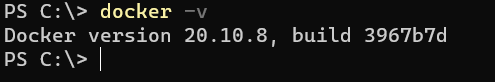

后续就可以在power shell中使用docker的命令来操作docker

例如：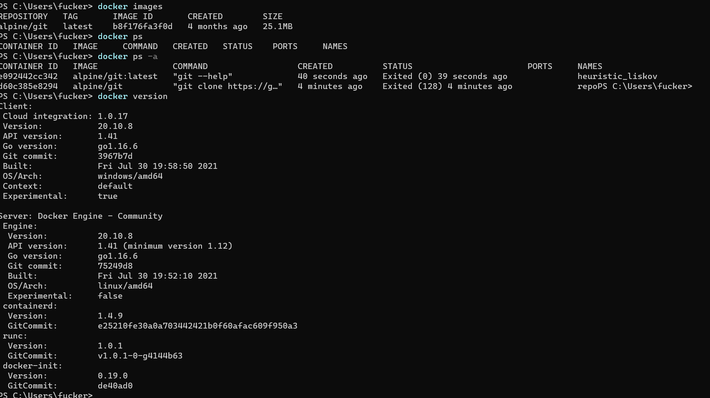


## 配置


### 换源

使用国内源替代掉docker的默认源

```
    "https://hub-mirror.c.163.com",
    "https://ustc-edu-cn.mirror.aliyuncs.com",
    "https://ghcr.io",
    "https://mirror.baidubce.com"
```


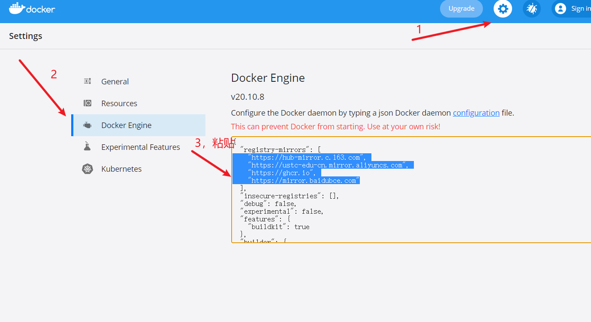


### 测试

**拉取Nginx镜像**

```
docker pull nginx:latest
```


**端口映射+新建并启动Nginx**

```
docker run --name my-nginx -p 80:80 -d nginx
```

> --name my-nginx 指定容器的名称
>
> -p 80:80 映射端口
>
> -d 守护进程运行
>
> nginx 镜像版本，也可以指定版本，如：nginx:1.18.0
>
> 如果单纯想启动一个测试用的nginx就启动完了，测试效果如下


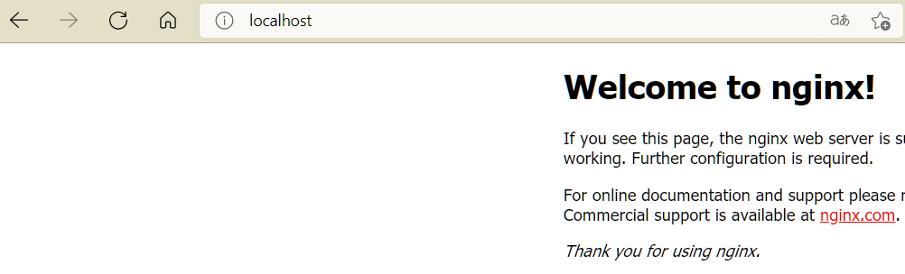


**停止+删除nginx**

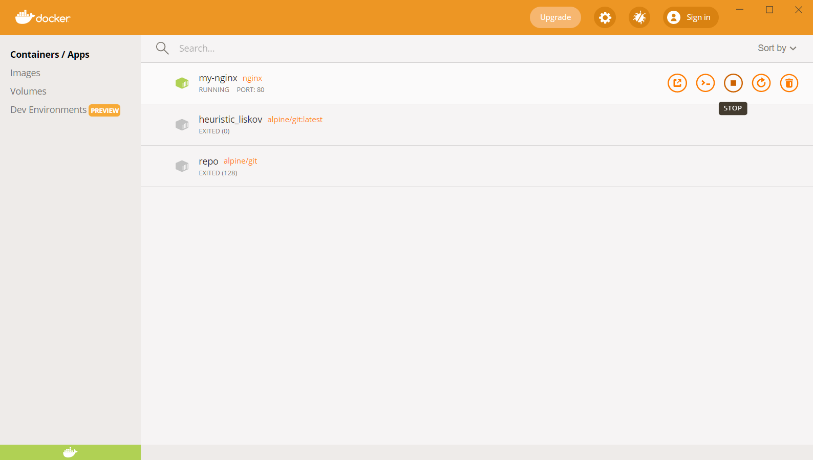

stop代表停止，右边的垃圾桶图标则是删除


*命令行删除：*

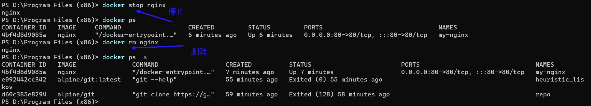


### docker网络连接（真正的坑点）

出现连接容器的bug，大部分都是因为这个坑


Docker for win10的docker实际运行在新建的WSL2宿主机。那此时如何与Windows通信？

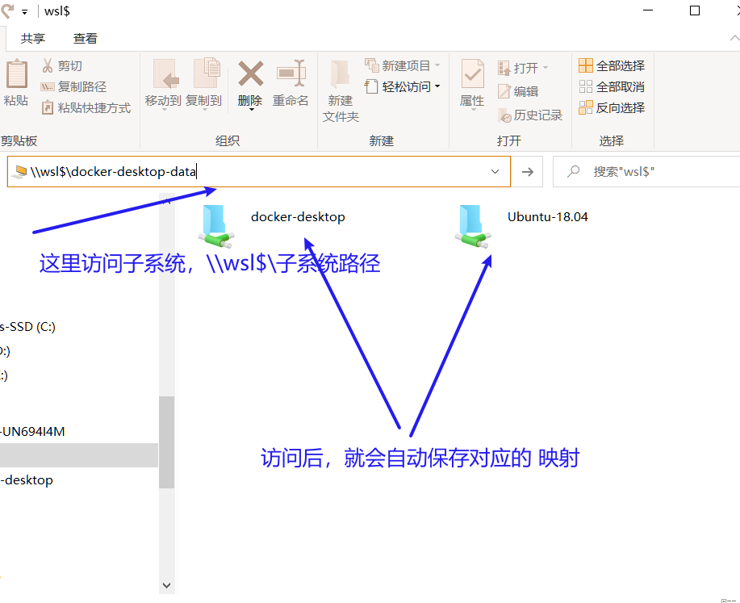


此时存在3个IP：

- docker容器的IP
- Linux宿主机IP
- 本地Windows IP

**访问哪个IP才能访问到容器内部的应用？**

使用常用的测试容器Nginx

测试结果：

 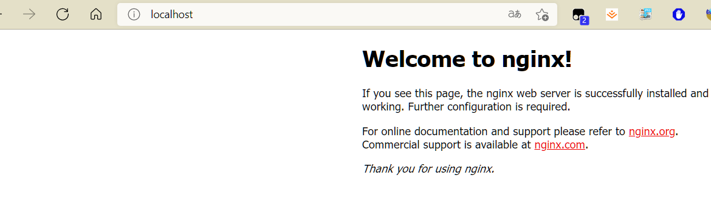

可以看到**使用localhost，即可访问**。这是WSL2的优化


同时，大量镜像甚至没有安装net-tools，无法直接查看IP。**即默认，容器对外部隐藏IP**

如果容器默认对外部隐藏IP，那连接容器的方式就完全通过 docker宿主机IP+端口转发（访问宿主机上指定的端口，然后宿主机端口帮忙跳转到容器端口）。

docker for windows桌面版是一种特殊的Windows安装docker的方式。其中docker宿主机IP被设定和本地 Windows IP一样。而WSL2直接安装的方式中，两者是不同IP，只不过在同一个WSL子网下。


**实际ping容器的IP和端口号**

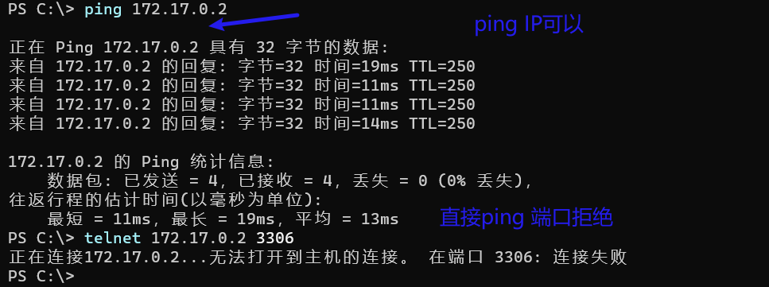

这里陷入过误区，一直在用容器端口+3306连接数据库，一直认为是docker for windows有坑。或者是Windows防火墙策略。


### 异端口转发测试（装docker，跑这个测试）：

**查看被禁用的端口**

```
netsh interface ipv4 show excludedportrange protocol=tcp
```

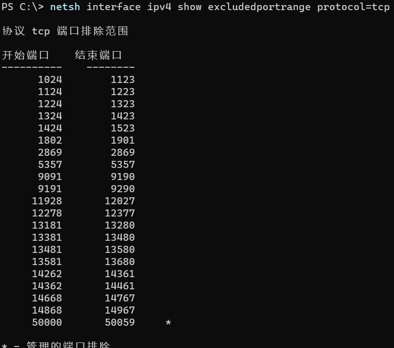


**选择9999作为测试端口号进行测试：**

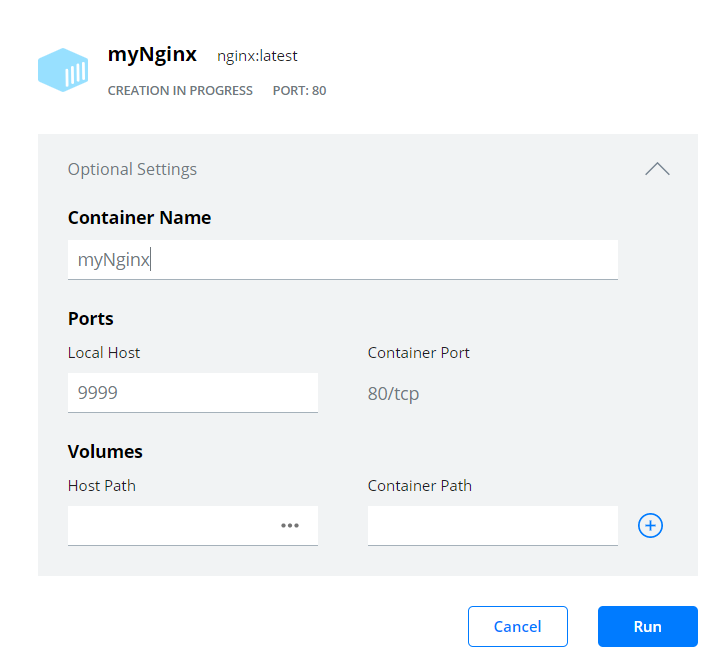


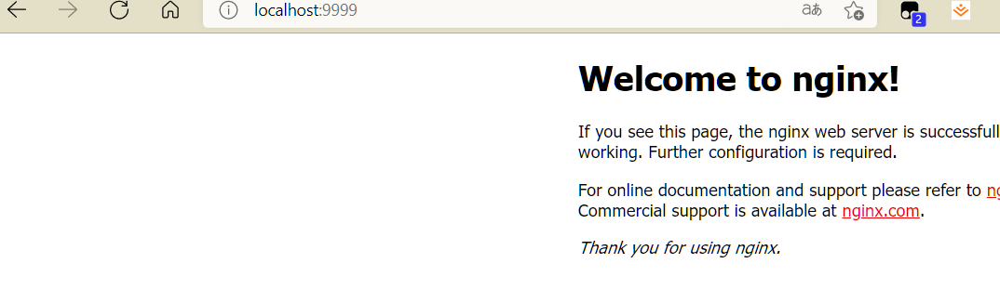


**查看端口转发：**

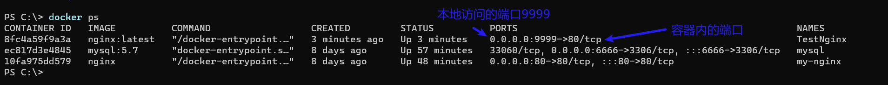


### docker中的MySQL安装+配置+连接 


**配置运行容器**


查看禁止的端口：

```
netsh interface ipv4 show excludedportrange protocol=tcp
```

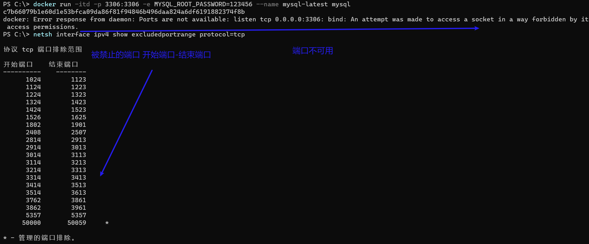

选择6666做为本地端口号


**启动MySQL容器，需要指定初始密码+端口映射**

这里密码设置为了 root

```
docker run --name MYSQL -e MYSQL_ROOT_PASSWORD=root -p 6666:3306 -itd mysql:5.7 /bin/bash
```


**连接到容器**

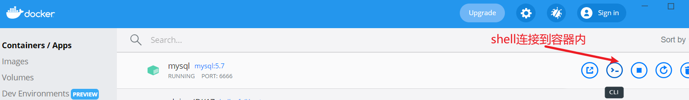

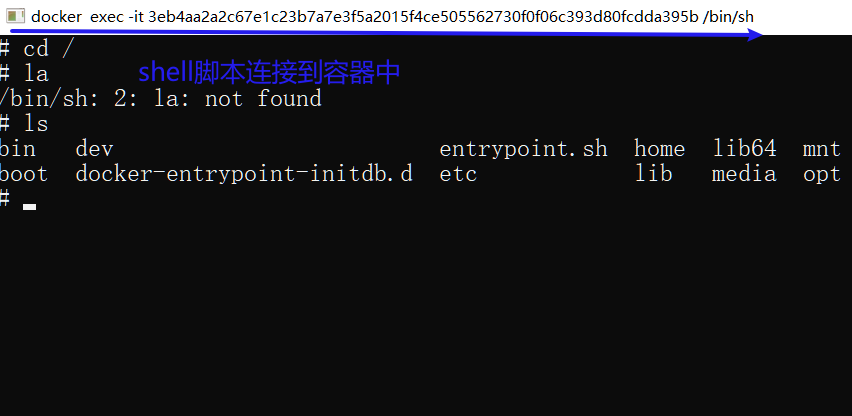


登录容器内的MySQL

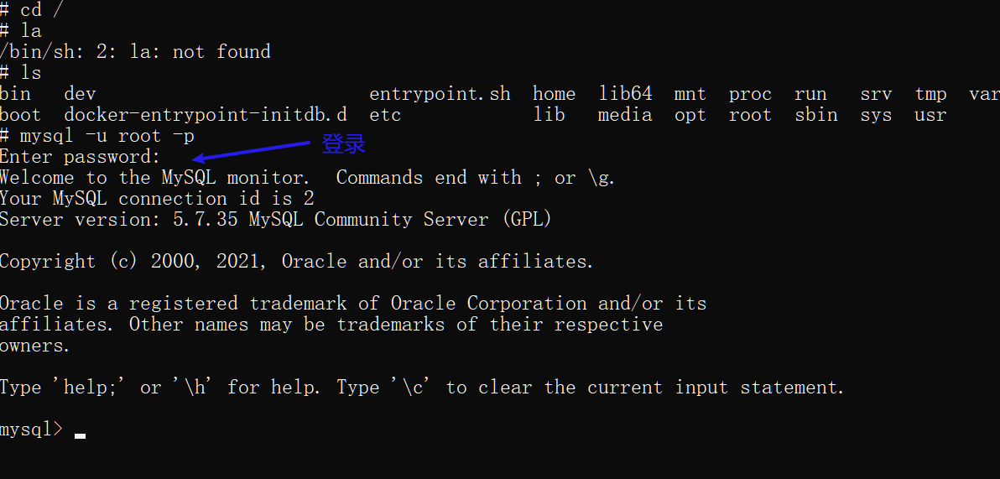


**配置MySQL-改字符集：**

进入容器修改my.cnf文件

查找 my.cnf文件

```
mysql --help | grep my.cnf
```

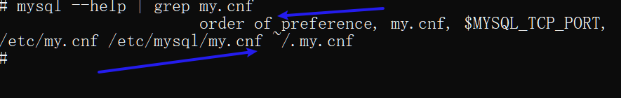


修改/etc/mysql/my.cnf文件


**坑点：没有nano和vi**

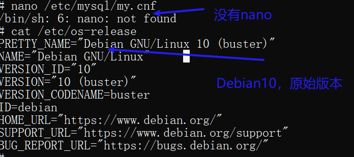


*没有vi和nano，如何改文件+换源？*

使用手动echo添加源，再安装nano

- 备份源

  ```
  cp /etc/apt/sources.list /etc/apt/sources.list.bak
  ```

- 删掉原本的sources.list

  ```
  rm -rf /etc/apt/sources.list
  ```

- 手动echo添加源 

  echo 源 > sources.list

  ```
  echo deb http://mirrors.aliyun.com/debian/ buster main non-free contrib deb-src http://mirrors.aliyun.com/debian/ buster main non-free contrib deb http://mirrors.aliyun.com/debian-security buster/updates main deb-src http://mirrors.aliyun.com/debian-security buster/updates main deb http://mirrors.aliyun.com/debian/ buster-updates main non-free contrib deb-src http://mirrors.aliyun.com/debian/ buster-updates main non-free contrib deb http://mirrors.aliyun.com/debian/ buster-backports main non-free contrib deb-src http://mirrors.aliyun.com/debian/ buster-backports main non-free contrib > sources.list
  ```

- 更新

  ```
  apt update
  apt upgrade
  ```

- 安装nano

  ```
  apt install nano
  ```

  

**开始修改**

```
nano /etc/mysql/my.cnf
```

添加进去的字符集参数

```
[mysqld]
character-set-server=utf8mb4
[client]
default-character-set=utf8mb4
[mysql]
default-character-set=utf8mb4
```

**进入mysql中查询字符集**

```
show variables like '%character%';
```

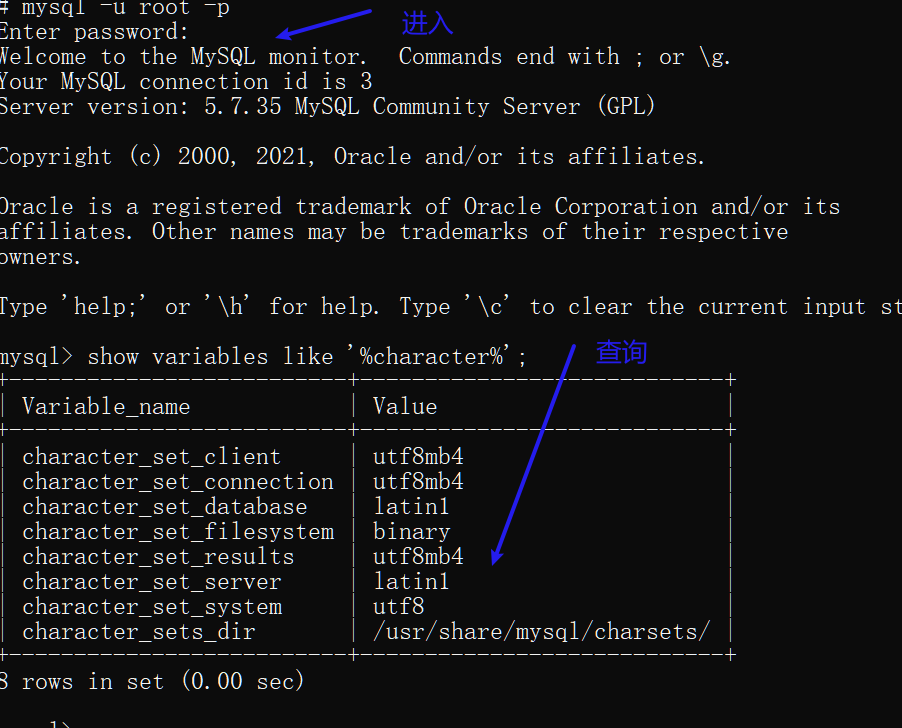


**重启MySQL容器后再查询字符集**

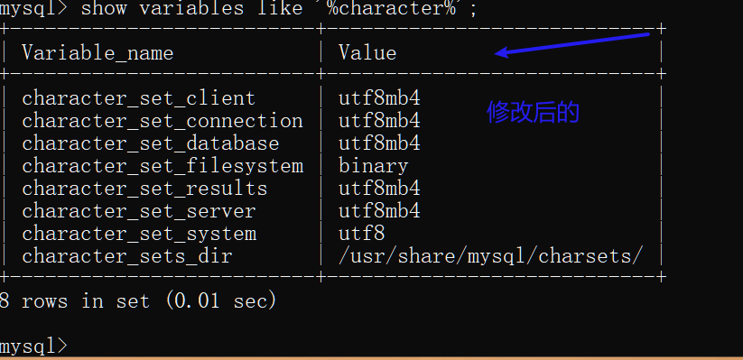


**配置MySQL -允许远程登录**

选择mysql库

```
use mysql;
```

查看用户表

```
SELECT `Host`,`User` FROM user;
```

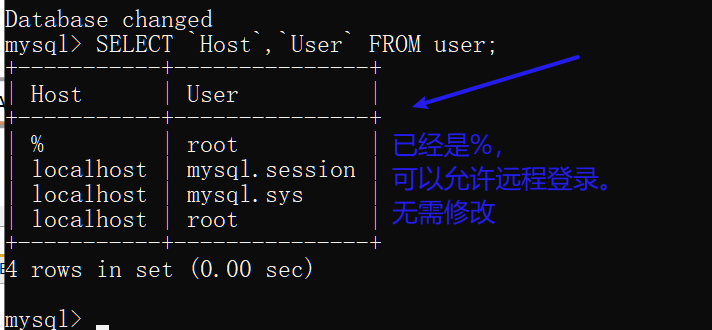


如果不是%,则使用修改命令

```
UPDATE user SET `Host` = '%' WHERE `User` = 'root' LIMIT 1;
```


**本地Windows连接MySQL容器**

IP使用localhost，端口号填新建容器时选择的本地转发端口

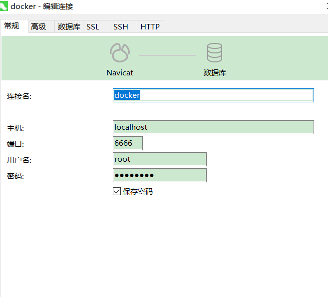

连接成功

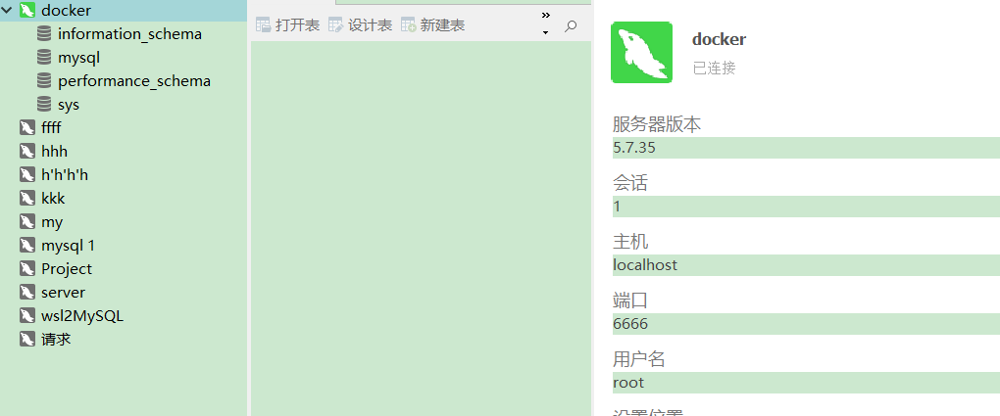


## 参考

https://blog.lupf.cn/articles/2020/11/08/1604845476002.html#toc_h5_16

https://blog.csdn.net/weixin_45859850/article/details/115387169

https://zhuanlan.zhihu.com/p/365632905

https://www.cnblogs.com/sablier/p/11605606.html

https://zhuanlan.zhihu.com/p/372062996

https://zhuanlan.zhihu.com/p/266534015

https://zhuanlan.zhihu.com/p/143857664